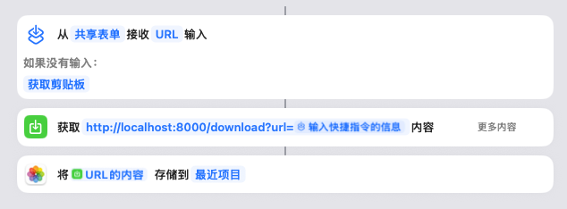
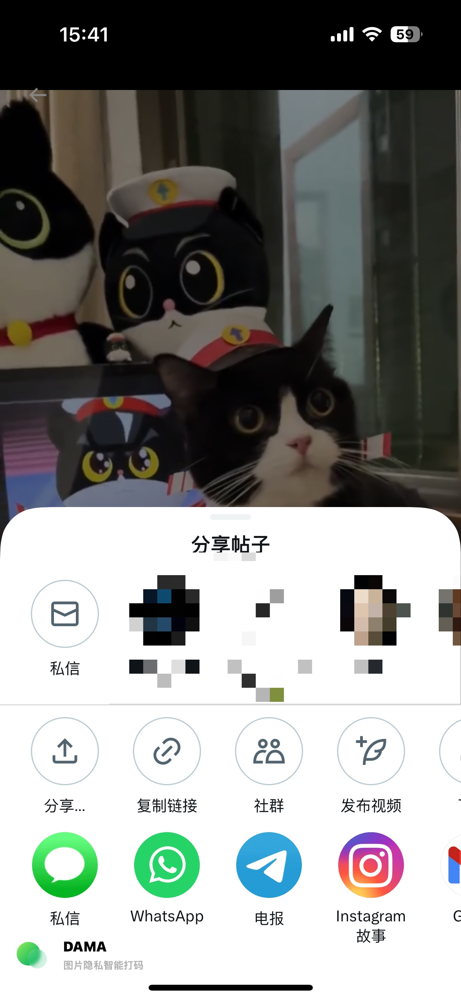
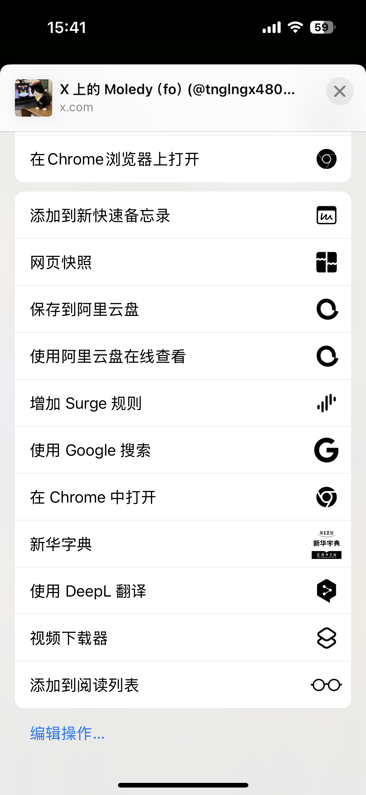

# Video Downloader

一个基于 Flask 和 yt-dlp 的视频下载服务，支持通过 iOS 快捷指令快速下载视频到相册。

## 功能特点

- 支持多个视频平台的下载
- 自动清理过期下载文件
- iOS 快捷指令支持
- 支持视频和音频格式
- RESTful API 接口

## 安装说明

### 环境要求

- Python 3.8+
- pip
- yt-dlp
- Flask
- APScheduler

### 安装步骤

1. 克隆仓库
```bash
git clone https://github.com/xuanlingzi/video_downloader.git
cd video_downloader
```

2. 创建虚拟环境
```bash
python3 -m venv .venv
source .venv/bin/activate  # Linux/Mac
# 或
# .venv\Scripts\activate  # Windows
```

3. 安装依赖
```bash
pip3 install -r requirements.txt
```

### 启动服务

```bash
python3 app.py
```

服务将在 http://localhost:8000 启动

## iOS快捷指令配置指南

### 基础配置步骤

#### 1. 创建快捷指令
1. 打开"快捷指令"应用
2. 点击右上角"+"创建新快捷指令
3. 点击"添加操作"

#### 2. 添加必要动作
- 添加"接收分享的内容"动作
- 添加"获取URL内容"动作
- 添加"保存到相册"动作

#### 3. 配置URL设置
在"获取URL内容"中配置：
```bash
http://你的服务器IP:8080/download?url=[快捷方式输入]
```


#### 4. 高级设置
展开"显示更多"选项：
- **请求方法**：GET
- **请求超时**：300秒
- **请求头部**：默认

#### 5. 完成设置
1. 点击右上角"完成"
2. 为快捷指令命名（建议：视频下载器）

### 使用方法

1. 在支持的应用中找到要下载的视频
   - YouTube
   - Twitter
   - Bilibili
   - 其他支持分享的平台

2. 点击分享按钮
   

3. 在分享菜单中选择"视频下载器"
   

4. 选择"视频下载器"
   > 💡 提示：可以将常用的快捷指令置顶

5. 等待下载完成
   - 下载期间请保持应用在前台
   - 视频会自动保存到相册

### 常见问题

#### 下载失败？
- 检查网络连接
- 确保服务器地址正确
- 验证视频链接可访问

#### 保存失败？
- 检查相册访问权限
- 确保手机存储空间充足
- 验证视频格式是否支持

### 高级功能

#### 支持格式选择
添加菜单动作，支持选择下载格式：
```bash
http://你的服务器IP:8000/download?url=[快捷方式输入]&format=[菜单结果]
```

#### 下载通知
可以添加通知动作：
- 下载开始时显示通知
- 下载完成后显示通知
- 下载失败时显示错误信息

#### 自动化触发
可以配置自动化场景：
- 分享时自动触发
- 复制链接时自动检测
- 定时批量下载

> 🔔 注意：请遵守相关平台的使用条款和版权规定